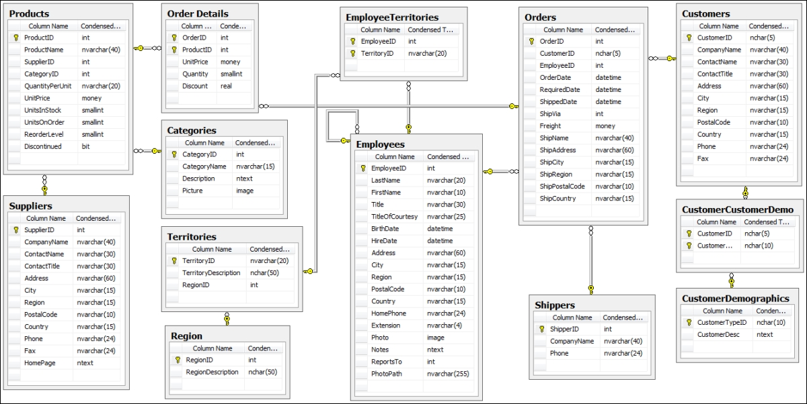

# SQL - Reference Cookbook

Structure Query Language is a domain-specific language used in programming and designed for managing data held in a relational database management system.

The standard dummy database that it is used for practice is the Northwind [Sample Database](https://github.com/YugaByte/yugabyte-db/wiki/Northwind-Sample-Database).



##  Entity Relationship Diagram (ERD) 

### Attributes

An attribute is a characteristic or a trait, that is common among all **Entities**. _E.g._: _Id_, _date_, _name_, ... .

### Entity

An object to be track in a database. It holds a group of **attributes**. _E.g._: _Clients_, _Orders_, _Products_.

### Table

Together the `Entities` and the collection of `Attributes` form a **Table**, which are represent by `rows` and `columns` respectively. These tables are the main objects in a database. Note that a database can have multiple **Tables**. 

### Relation Between Tables (Cardinality)


---

## Database

### Create a database

``` sql
CREATE DATABASE test_db;
```

### Show list of databases

```sql 
SHOW DATABASES;
```

### Load a database

``` sql 
USE test_db;
```

### Unload a database

``` sql 
DROP DATABASE test_db;
```

### Save a database

``` sql
BACKUP DATABASE test_db
TO DISK = '/home';
```

---

## TABLES

### Create a **table**.

``` sql
CREATE TABLE Persons (
    PersonID int,
    LastName varchar(255),
    FirstName varchar(255),
    Address varchar(255),
    City varchar(255)
);
```

### Drop a Table

The `DROP TABLE` statement is used to drop an existing table in a database.

```sqlite
DROP TABLE Shippers; 
```


---

## TYPES

### EXACT VALUE 

- INTEGER(INT)

```sqlite

```

- SMALLINT

```sqlite

```

- DECIMAL

```sqlite

```

### Floating-Point Types

- FLOAT

```sqlite

```

- REAL

```sqlite

```

- DOUBLE PRECISION

```sqlite

```

### DATA

- DATE

```sqlite

```

- TIME

```sqlite

```

- DATETIME

```sqlite

```

- TIMESTAMP

```sqlite

```

- YEAR

```sqlite

```

### Character

---

## CONSTRAINS


### PK - Primary key

- Unique
- Static (Never Changing)
- Auto increment
- Not Null

```sql
CREATE TABLE Persons (
    ID int NOT NULL PRIMARY KEY,
    LastName varchar(255) NOT NULL,
    FirstName varchar(255),
    Age int
);
```


### FK - Foreign Key

- Not Null
- Static

``` sql
CREATE TABLE Orders (
    PersonID int FOREIGN KEY REFERENCES Persons(PersonID)
    OrderID int NOT NULL PRIMARY KEY,
    OrderNumber int NOT NULL,
);
```


### CPK - composed primary key

- Unique
- Static

```sql
CREATE TABLE info (
    first_ID INT NOT NULL,
    second_ID INT NOT NULL,
    PRIMARY KEY (first_ID, second_ID)
);
```

### Default - Add a default value when none is inserted.

``` sql
CREATE TABLE Orders (
    ID int NOT NULL,
    OrderNumber int NOT NULL,
    OrderDate date DEFAULT GETDATE()
);
```

- Add Default of a table

```sql
ALTER TABLE Persons
ALTER City SET DEFAULT 'Winnipeg';
```

- Drop Default to a table

``` sql
ALTER TABLE Persons
ALTER COLUMN City SET DEFAULT 'Winnipeg';
```

### CHECK - Check constraint

```sql
CREATE TABLE Persons (
    ID int NOT NULL,
    LastName varchar(255) NOT NULL,
    FirstName varchar(255),
    Age int CHECK (Age>=18)
);
```


- Add check.

```sql
ALTER TABLE Persons
ADD CHECK (Age>=18);
```

- Drop check.

```sql
ALTER TABLE Persons
DROP CHECK CHK_PersonAge;
```

---

## Index

`CREATE INDEX` - creates an index (search key)

`DROP INDEX` - deletes an index  

---

## OPERATORS

### Arithmetic Operators

``` sql 
+
```

Adds values on either side of the operator[^1]. 

---

```sql 
-
```

 Subtracts right hand operand from left hand operand.

---

```sql 
*
```

 Multiplies values on either side of the operator.

---

```SQLITE
/
```

 Divides left hand operand by right hand operand.

---

```sqlite
%
```

**Modulus** - Divides left hand operand by right hand operand and returns remainder.

[^1]: a AS 10 and b AS 20.

---

### Comparison Operators

```sql
=
```

 Checks if the values of two operands are equal or not, if yes then condition becomes true.

---

```sql 
!=
```

 Checks if the values of two operands are equal or not, if values are not equal then condition becomes true.

---

```sql
<>
```

 Checks if the values of two operands are equal or not, if values are not equal then condition becomes true.

---

```sql
>
```

 Checks if the value of left operand is greater than the value of right operand, if yes then condition becomes true.

---

```sql
<  
```

Checks if the value of left operand is less than the value of right operand, if yes then condition becomes true.

---

```sql
=
```

Checks if the value of left operand is greater than or equal to the value of right operand, if yes then condition becomes true.

---

```SQL
<=
```

 Checks if the value of left operand is less than or equal to the value of right operand, if yes then condition becomes true.

---

```SQL
!<  
```

 Checks if the value of left operand is not less than the value of right operand, if yes then condition becomes true.

---

```SQL
!> 
```

 Checks if the value of left operand is not greater than the value of right operand, if yes then condition becomes true.

---

### Logical Operators

```sql
ALL
```

The ```ALL``` operator is used to compare a value to all values in another value set.

```MYsql
AND
```

The ``AND`` operator allows the existence of multiple conditions in an ``SQL`` statement's ``WHERE`` clause.

```sqlite
ANY
```

The ``ANY`` operator is used to compare a value to any applicable value in the list as per the condition.

```SQLITE
BETWEEN
```

The ``BETWEEN`` operator is used to search for values that are within a set of values, given the minimum value and the maximum value.

```MYSQL
EXISTS
```

The ``EXISTS`` operator is used to search for the presence of a row in a specified table that meets a certain criterion.

```sqlite
IN
```

The ``IN`` operator is used to compare a value to a list of literal values that have been specified.

```sqlite
LIKE
```

The ``LIKE`` operator is used to compare a value to similar values using wildcard operators.

```sqlite
NOT
```

The NOT operator reverses the meaning of the logical operator with which it is used. E.g.: ``NOT EXISTS``, ``NOT BETWEEN``,`` NOT IN``, etc. This is a negate operator.

```sql
OR
```

The ``OR`` operator is used to combine multiple conditions in an ``SQL`` statement's ``WHERE`` clause.

```sql
IS NULL
```

The ``NULL`` operator is used to compare a value with a ``NULL`` value.

```sql
UNIQUE
```

The ``UNIQUE`` operator searches every row of a specified table for uniqueness (no duplicates).

---

## QUERIES

```sqlite
SELECT
```


```sqlite
FROM
```


```sqlite
ALL
```


```sqlite
ANY
```


```sqlite
INTO
```


```sqlite
SELECT DISTINCT
```


```sqlite
WHERE
```


```sqlite
AND
```


```sqlite
OR
```


```sqlite
INSERT INTO
```


```sqlite
VALUES
```


```sqlite
UPDATE
```


```sqlite
DELETE
```


```sqlite
HAVING
```


```sqlite
EXISTS
```


```sqlite
GROUP BY
```


```
ORDER BY
```


```SQLITE
CASE
```


```SQLITE
IFNULL
```


```SQLITE
ISNULL
```


```SQLITE
COALESCE
```

---

## JOINS


---

## SCRIPTS

```sqlite 
PROCEDURE
```


- Count the number of time the max value appear.

```SQL
SELECT (salary * months) AS earnings,
COUNT(*)
FROM employee
GROUP BY 1
ORDER BY earnings
DESC limit 1;
```

- 

```SQL
SELECT CONCAT(NAME,'(',LEFT(OCCUPATION,1),')')
FROM OCCUPATIONS
ORDER BY NAME ASC;

SELECT CONCAT( 'There are a total of ', COUNT( OCCUPATION ), ' ', LOWER( OCCUPATION ),'s.') AS NUM_OCCUP
FROM OCCUPATIONS
GROUP BY OCCUPATION
ORDER BY NUM_OCCUP ASC;
```


